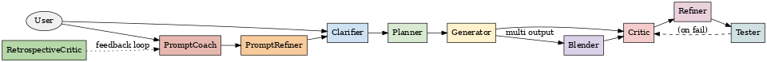

# Claude Multi-Agent Orchestration System

> **ℹ️ Project Status:** This repository contains a functional multi-agent orchestration system with 11 specialized agents. Each agent includes embedded safeguards and has been validated for orchestration effectiveness.

A multi-agent system design for Claude Code that orchestrates 11 specialized AI agents with embedded loop prevention and intelligent workflow management.




## System Overview

This system transforms complex, multi-step AI tasks into manageable agent pipelines while preventing common failure modes like infinite loops, excessive refinement cycles, and runaway processing chains.

**Key Innovation:** Embedded orchestration safeguards within each agent eliminate the need for separate orchestration infrastructure while preventing common failure modes.

## Architecture

### Core Pipeline Agents
- **Clarifier** → Transforms vague requests into precise specifications
- **Planner** → Decomposes goals into structured execution plans  
- **Generator** → Implements plans into concrete deliverables
- **Critic** → Evaluates outputs for quality and correctness
- **Refiner** → Applies targeted improvements based on feedback
- **Tester** → Validates implementations with appropriate test depth

### Specialized Agents
- **PromptCoach** → Teaches effective prompt engineering patterns
- **PromptRefiner** → Automatically optimizes prompt effectiveness
- **Blender** → Synthesizes multiple outputs into superior results
- **RetrospectiveCritic** → Analyzes prompt-outcome relationships
- **Meta** → Generates new subagent configurations

## Orchestration Intelligence

### Loop Prevention
- **Hard iteration limits** (2-3 per agent type)
- **Diminishing returns detection** with improvement thresholds
- **Pipeline length monitoring** with warnings at 8+ agents
- **User decision points** at natural workflow boundaries

### Efficiency Controls
- Quality-effort calibration based on pipeline investment
- Automatic "accept current state" options
- Alternative pathway recommendations
- Resource-appropriate processing depth

## Configuration Specification

```yaml
Agent Configuration:
  max_iterations: 3         # Hard limit: Clarifier=3, Critic=2, others=2
  quality_threshold: 0.85   # Minimum improvement score to continue iteration
  pipeline_position: 4      # Position in typical workflow (1=Clarifier, 10=Tester)
  effort_calibration:
    - low: "Basic validation, single-pass processing"
    - medium: "Comprehensive analysis, 2-3 refinement cycles"
    - high: "Deep optimization, full safeguard validation"
```

*Note: This YAML represents the configuration structure embedded within each agent's markdown frontmatter for orchestration control.*

Each agent includes YAML frontmatter and orchestration status outputs for pipeline coordination.

## Validation & Testing

**Test Coverage:** Safeguard scenarios validated through design testing
- Clarifier ↔ Planner loop prevention
- Critic → Refiner → Critic cycle detection  
- Pipeline runaway prevention (>10 agents)
- Diminishing returns detection
- User decision point validation

**Test Location:** `ai_docs/tests/`
- `orchestration_safeguards_test_plan.md` - Test scenarios and methodology
- `orchestration_safeguards_test_execution_20250730_144429.md` - Validation results (100% pass rate)

## Maintenance Considerations

### Monitoring (When Implemented)
- Track agent iteration counts in workflows
- Monitor pipeline lengths for efficiency optimization
- Validate user decision point effectiveness
- Measure improvement thresholds for calibration

### Agent Definition Updates
- Maintain YAML frontmatter consistency across agents
- Preserve orchestration status output formats
- Validate safeguards after agent definition changes
- Document iteration limit adjustments with rationale

### System Evolution
- Agent addition requires orchestration awareness integration
- Pipeline position assignments affect efficiency calibration
- New failure modes need corresponding safeguard patterns

## Development Workflow

1. **Agent Definition Updates:** Update `.claude/agents/*.md` with orchestration preserved
2. **Testing:** Review and execute scenarios in `ai_docs/tests/orchestration_safeguards_test_plan.md`
3. **Validation:** Verify safeguard effectiveness using test methodology
4. **Documentation:** Update conversation logs in `ai_docs/claude_conversations/`

## Next Development Steps

### Immediate Opportunities
- **Performance Metrics Dashboard** - Real-time pipeline efficiency monitoring
- **Agent Usage Analytics** - Pattern analysis for optimization opportunities  
- **Dynamic Threshold Tuning** - ML-based improvement threshold calibration
- **Workflow Templates** - Pre-configured agent chains for common task types

### Advanced Features
- **Conditional Agent Routing** - Smart pathway selection based on task characteristics
- **Parallel Agent Execution** - Concurrent processing where dependencies allow
- **Agent Learning Integration** - Feedback loops for continuous improvement
- **External Tool Integration** - Seamless connection to development toolchains

### Scalability Enhancements
- **Agent Pool Management** - Resource allocation and load balancing
- **Distributed Orchestration** - Multi-instance coordination for large workflows
- **Caching Layer** - Intelligent result reuse across similar tasks
- **Pipeline Optimization Engine** - Automatic workflow efficiency improvements

## Requirements & Setup

### Prerequisites
- **Claude Code** with subagent support capability
- Understanding of Claude Code's agent invocation system
- Familiarity with YAML frontmatter configuration

### System Requirements
- This is a design specification for Claude Code integration
- No additional runtime dependencies beyond Claude Code itself
- Agent definitions use standard markdown format with YAML frontmatter

### Implementation Notes
- Agent definitions are located in `.claude/agents/`
- Each agent includes orchestration awareness metadata
- Testing methodology documented in `ai_docs/tests/`
- Conversation logs maintained in `ai_docs/claude_conversations/`

### Getting Started
1. Review agent definitions in `.claude/agents/`
2. Understand orchestration safeguards in each agent
3. Examine test scenarios in `ai_docs/tests/orchestration_safeguards_test_plan.md`
4. Reference validation results in test execution logs

**System Status:** Functional multi-agent orchestration system with validated safeguards and checkpoint workflow management.

## Custom Commands

### Checkpoint Workflow

The system includes a comprehensive checkpoint command that follows a 6-step process for project state management:

1. **Compact Claude Conversation Context** - Use Claude Code's conversation compacting feature
2. **Save Claude Conversation Context** - Archive conversation to `./ai_docs/claude_conversations/` with descriptive filename and timestamp
3. **Update Claude Memory** - Refresh CLAUDE.md with current project snapshot
4. **Update README.md** - Ensure documentation reflects current state with B+ quality standards
5. **Stage and Commit** - Git commit recent changes with appropriate message
6. **Summarize Checkpoint** - Provide execution summary with strengths and improvement opportunities

**Usage Examples:**
```bash
# Basic checkpoint after significant changes
@checkpoint

# Checkpoint with specific focus
@checkpoint "README optimization and testing validation"
```

**Command Location:** `.claude/commands/checkpoint.md`

Invoke the checkpoint command through Claude Code's custom command system to maintain project state consistency and documentation quality. The command automatically handles conversation archiving, documentation updates, and git commits with appropriate messages.